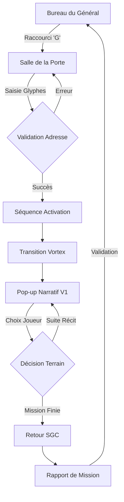

# UX Design Specification stargate-command

**Author:** Dylan
**Date:** 2026-04-27

---

<!-- UX design content will be appended sequentially through collaborative workflow steps -->

## Executive Summary

### Project Vision
Stargate Chronicles propose une expérience de gestion immersive centrée sur le Bureau du Général. Le joueur navigue physiquement dans le SGC via un menu latéral, chaque infrastructure offrant une vue fidèle au canon enrichie d'interfaces de terminaux rétro-militaires.

### Key Design Challenges
- **Navigation Contextuelle :** Assurer une transition fluide entre la vue du Bureau et les interfaces techniques des salles.
- **Hiérarchie du Pop-up Narratif :** Respecter strictement l'ordre visuel (1. Illustration Paysage / 2. Narration & Choix / 3. Squad Bar) pour lier l'action au sol à l'état de l'équipe.
- **Fidélité Canonique :** Créer des fonds de décors qui respectent scrupuleusement l'architecture du SGC et son style technologique rétro-militaire.

### Design Opportunities
- **Transitions Immersives :** Utiliser les effets visuels de la Porte (vortex, friture de signal) pour masquer les chargements et renforcer le changement de contexte entre la base et le terrain.
- **Immersion Diégétique :** Chaque panneau de contrôle est conçu comme un terminal réel du SGC, alliant modernité de jeu et élégance rétro.
- **Bureau du Général :** Utiliser ce hub central comme cœur des notifications et du commandement.

## Core Player Experience

### Defining Experience
L'expérience de **Stargate Chronicles** repose sur la dualité entre le commandement froid et stratégique au SGC et l'aventure humaine imprévisible sur le terrain. Le joueur doit se sentir comme l'autorité finale, dont chaque décision (du recrutement au choix de dialogue) pèse sur la survie du programme.

### Platform Strategy
- **Plateforme :** PC (Godot 4).
- **Contrôles :** Optimisé pour le combo Clavier/Souris, mais avec une contrainte de **conception "Keyboard-Only"**. 
- **Design Clavier :** Utilisation de raccourcis logiques (ex: touches numériques pour les choix narratifs, Tab pour changer de salle) pour une manipulation rapide type "Power User" renforçant l'aspect terminal militaire.

### Effortless Interactions
- **Navigation Inter-Salles :** Le passage du Bureau au Laboratoire ou à la Porte des Étoiles doit être instantané (zéro friction).
- **Lancement d'Exploration :** Le processus de composition de l'équipe et de l'adresse doit être fluide, transformant une procédure complexe en un rituel satisfaisant.

### Critical Success Moments
- **L'Événement Narratif :** C'est le moment "vérité" où le joueur voit ses choix et sa préparation payer (ou échouer).
- **La Narration Immérsive :** Si la lecture et l'interaction avec le pop-up narratif sont captivantes, le joueur restera engagé dans la boucle de gestion pour voir la suite.

### Experience Principles
1.  **Priorité au Clavier (Command-Line Feeling) :** L'UI doit être entièrement navigable au clavier, renforçant l'impression de manipuler un terminal militaire diégétique.
2.  **Réactivité Instantanée :** Aucun délai entre les menus de base ; la base est le prolongement du bureau du Général.
3.  **Narration Spectacle :** Le pop-up d'événement est le cœur émotionnel du jeu ; sa structure tripartite (Illustration / Narration / Squad Bar) garantit immersion et lisibilité.
4.  **Lisibilité Décisionnelle :** Dans les moments critiques, le joueur doit comprendre immédiatement l'impact potentiel de ses choix sur son équipe grâce à des feedbacks visuels clairs (ex: portraits réactifs).

## Desired Emotional Response

### Primary Emotional Goals
- **Autorité et Responsabilité :** Le joueur doit ressentir le poids et le privilège d'avoir le programme Stargate entre ses mains. Il n'est pas un simple spectateur, mais l'architecte de l'influence de la Terre dans la galaxie.
- **Émerveillement et Curiosité :** Chaque voyage à travers la Porte doit être une récompense. L'inconnu ne doit pas seulement être dangereux, il doit être beau et intrigant.
- **Immersion Canonique :** Le sentiment d'être "dans" la série, entouré par la technologie et les enjeux familiers du SGC.
- **Fierté et Soulagement :** L'émotion intense de voir une équipe rentrer à la base après une mission périlleuse où les choix du joueur ont fait la différence.

### Emotional Journey Mapping
- **Bureau du Général (Hub) :** Maîtrise, calme stratégique, sentiment de puissance.
- **Activation de la Porte :** Hâte et anticipation. Le rituel des glyphes doit monter en tension jusqu'au "kawoosh".
- **Exploration (Pop-up) :** Émerveillement visuel immédiat (illustration), suivi d'une réflexion intense lors des dilemmes narratifs.
- **Échec (Perte d'un membre) :** Tristesse authentique et déception. La perte doit être vécue comme un sacrifice lourd de sens, pas comme une simple statistique.

### Micro-Emotions
- **Excitation vs Anxiété :** Pendant les choix narratifs, le joueur doit être partagé entre l'envie de découvrir (excitation) et la peur des conséquences pour son équipe (anxiété).
- **Accomplissement vs Frustration :** Un succès doit générer un sentiment de compétence ("Je suis un bon Général"), tandis qu'un échec doit pousser à la détermination plutôt qu'à l'agacement.

### Design Implications
- **Empowerment par l'Interface :** L'utilisation du clavier ("Power User") renforce le sentiment de maîtrise technique et d'autorité.
- **Vecteur d'Émerveillement :** Les illustrations paysage du pop-up doivent être d'une qualité exceptionnelle (style Concept Art) pour récompenser chaque voyage.
- **Visualisation du Soulagement :** Prévoir une séquence de "Débriefing" où l'on voit l'équipe passer le diaphragme de la porte pour marquer la fin de l'anxiété de la mission.

### Emotional Design Principles
1. **La Porte est une Récompense :** L'audio et le visuel de l'activation doivent être les moments les plus gratifiants du jeu.
2. **Le Poids des Hommes :** La "Squad Bar" doit rendre les membres d'équipe assez familiers pour que leur santé soit une source d'anxiété réelle.
3. **Esthétique de la Découverte :** Favoriser des visuels contrastés entre le bleu/gris militaire du SGC et les couleurs vibrantes des mondes explorés pour marquer l'émerveillement.
## UX Pattern Analysis & Inspiration

### Inspiring Products Analysis
- **Duskers (Tactical Terminal) :** Maître de l'interface par ligne de commande et du "tout clavier". Il prouve qu'une interface austère peut être incroyablement immersive.
- **Papers, Please (Bureau Diégétique) :** Transforme les tâches administratives en gameplay tendu via la manipulation d'objets physiques (dossiers, tampons).
- **FTL (Narrative Flow) :** Référence pour la gestion des événements aléatoires et des choix à conséquences immédiates sur une interface compacte.
- **XCOM (Emotional Attachment) :** Modèle pour la gestion de la "Caserne" et la personnalisation des soldats, rendant la mort permanente (permadeath) douloureuse.

### Transferable UX Patterns
- **Navigation Diégétique (Papers, Please) :** Le menu de navigation n'est pas un bouton abstrait, c'est le Général qui "clique" sur les dossiers ou les écrans de son bureau pour changer de vue (Labo, Porte, etc.).
- **Contrôle "Power User" (Duskers) :** Utilisation intensive des touches Tab, Esc et des chiffres (1-9) pour naviguer entre les systèmes du SGC sans jamais quitter le clavier.
- **Structure Narrative Tripartite (FTL) :** Le pop-up paysage/texte/choix permet de traiter n'importe quelle situation complexe (diplomatie, combat, piège) avec une interface constante.
- **Squad Visualisation (XCOM) :** Afficher les visages et les états de service des membres SG dans la "Squad Bar" pour transformer des statistiques en personnages.

### Anti-Patterns to Avoid
- **Menus "Floating" Modernes :** Éviter les interfaces transparentes et épurées de type *Atlantis* ou SF moderne qui casseraient le côté "militaire des années 90".
- **Navigation Souris Mandataire :** Interdire les interactions impossibles à réaliser au clavier (ex: sliders complexes sans entrée numérique).
- **Abondance de Fenêtres :** Éviter les fenêtres qui se chevauchent de façon désordonnée ; privilégier des vues fixes et claires.

### Design Inspiration Strategy
- **Adopter :** Le système de raccourcis clavier de *Duskers* pour toutes les actions répétitives (activation de la porte, changement de salle).
- **Adapter :** Le concept de bureau de *Papers, Please* pour en faire le Hub central du Général Hammond (le téléphone rouge, le briefing sur la table).
- **Transformer :** La "Squad Bar" narrative pour qu'elle réagisse dynamiquement au texte (ex: un membre mentionné dans le récit s'illumine dans la barre).

## Design System Foundation

### 1.1 Design System Choice
**Custom Godot 4 Theme** sur les composants UI natifs (`Control` nodes).

### Rationale for Selection
- **Navigation Clavier Native :** Godot gère de manière robuste le focus et l'ordre de tabulation, ce qui est indispensable pour la contrainte "Keyboard-Only".
- **Performance et Réactivité :** Utiliser les nœuds natifs garantit une interface instantanée (zéro délai), l'un de nos principes d'expérience.
    - **Infrastructures :** Utilisation de miniatures illustrées avec effet de zoom "percutant" (1.3x) centré au survol (micro-animation 0.1s).
    - **Données Chiffrées :** Utilisation de labels séparés pour les intitulés (blanc) et les valeurs (jaune #f5b914). Utilisation systématique du séparateur de milliers pour la lisibilité (ex: 50 000 USD).
    - **Cohérence :** Assurer la cohérence visuelle sur toutes les infrastructures (Labo, Porte, etc.) avec le style "Concept Art Graphic Novel".

### Implementation Approach
- Création d'une ressource `.theme` unique héritée par la scène racine.
- Surcharge des styles par défaut des boutons, panels et listes avec des textures "9-patch" pour conserver le look rétro sans déformation.
- Utilisation de polices monospacées (type terminal) et d'effets de scanlines via des shaders simples.

### Customization Strategy
- **Palette de couleurs :** Base de gris ardoise (#2b2d31), panneaux noir mat et accents jaune industriel (#f5b914).
- **Feedback visuel du Focus :** Étant donné le jeu au clavier, l'élément sélectionné doit être extrêmement visible (surbrillance, clignotement discret ou curseur de sélection type console).
- **Style Diégétique :** Intégration de bords arrondis type écrans CRT et d'effets de friture de signal lors des transitions.

## 2. Core Player Experience

### 2.1 Defining Experience
**Le "Field-Feed" Narratif :** C'est l'interaction vitale qui relie le Bureau du Général à l'action sur le terrain. À travers un pop-up vertical structuré (Illustration / Texte & Choix / Squad Bar), le joueur vit l'exploration par procuration. L'expérience se définit par la tension de la prise de décision sous incertitude : chaque choix est un pari sur la vie des membres SG et sur le succès du programme.

### 2.2 Player Mental Model
Le joueur adopte une posture de **Commandant à distance**. Son modèle mental est celui de l'évaluation des risques :
- "Qu'est-ce que ce choix va me coûter : une récompense ou un drame ?"
- "Est-ce que l'expertise de mon équipe suffit pour ce dilemme ?"
- "Que m'attend-il après cette décision ?"
Il s'attend à une narration réactive où son influence est palpable et où chaque mission est un rapport tactique en temps réel.

### 2.3 Success Criteria
- **L'Impact Immédiat :** Le joueur doit sentir instantanément que son choix a changé le cours du récit ou l'état de son équipe.
- **La Clarté des Enjeux :** Avant de choisir, le joueur doit pouvoir évaluer les risques (via des indices textuels ou des retours visuels sur la Squad Bar).
- **La Satisfaction du Rapport :** Le passage de la narration au **Rapport de Mission** final au SGC doit être fluide et gratifiant, marquant la conclusion logique de l'aventure.

### 2.4 Novel UX Patterns
- **Sélection Hybridée :** Utilisation des touches numériques (1, 2, 3) pour valider les choix, permettant une manipulation de "Power User" ultra-rapide.
- **Feedback "Squad-Reactive" :** Mise en évidence visuelle des membres de l'équipe concernés par un choix lors du survol ou de la sélection.
- **Le Silence Radio :** Utilisation de micro-pauses et d'effets sonores de friture après un choix critique pour renforcer l'anxiété avant la révélation des conséquences.

### 2.5 Experience Mechanics
1.  **Initiation :** L'envoi d'une équipe en exploration depuis la salle de la Porte déclenche l'ouverture du flux narratif.
2.  **Interaction :** Lecture de la situation illustrée, sélection d'une option via clavier (`1`, `2`, `3`) ou clic, et validation par `Entrée` ou `Espace`.
3.  **Feedback :** Mise à jour de la narration, modification de l'illustration paysage et mise à jour dynamique des états dans la Squad Bar (santé, moral).
4.  **Completion :** Conclusion de la séquence par un retour (ou non) au SGC, suivi de l'affichage automatique du **Rapport de Mission** synthétisant les gains et les pertes.
## Visual Design Foundation

### Color System
- **Thème "Slate Industrial" :** Fond gris ardoise moyen (#2b2d31), offrant une esthétique moderne et une excellente lisibilité. Panneaux et zones de contenu en noir profond (#141419).
- **Accents :** Jaune Industriel (#f5b914) pour les éléments interactifs, les glyphes et les appels à l'action.
- **Rationnel :** Ce contraste entre le gris ardoise et le jaune crée une interface élégante qui évoque les centres de commandement modernes tout en respectant l'héritage "industriel" du SGC (béton et lignes de sécurité).
- **Semantic Mapping :** 
  - *Accent :* Jaune (Action, Glyphes, Focus).
  - *Success :* Vert Émeraude (Mission accomplie, Santé ok).
  - *Error/Danger :* Rouge Alerte (Mort, Budget critique).
  - *Text :* Gris clair cassé (#e0e0e0) pour limiter la fatigue visuelle.

### Typography System
- **HUD & Données (Roboto Mono) :** Une police monospacée pour tout ce qui est technique (données, menus de base, boutons), renforçant l'aspect terminal militaire.
- **Narration & Choix (Plus Jakarta Sans) :** Une police sans-serif moderne choisie pour son élégance et son confort de lecture supérieur pour les textes longs.
- **Hiérarchie :** Échelle typographique claire (Taille minimale 14px pour le HUD, 16px pour la narration).

### Spacing & Layout Foundation
- **Layout Aéré :** Utilisation de marges larges (32px-40px) et d'espacements généreux pour un aspect clair, ordonné et "Premium".
- **Grille Tactique :** Alignement strict sur une grille de 8px pour une cohérence parfaite.

### Accessibility Considerations
- **Contraste :** Respect de la norme WCAG AA pour tous les textes sur fonds sombres.
- **Indicateurs de Focus :** Mise en évidence forte de l'élément sélectionné au clavier pour une navigation "Keyboard-Only" sans friction.
## Design Direction Decision

### Design Directions Explored
- **V1 - Focus Narratif :** Priorité à l'immersion visuelle avec une large illustration paysage et une mise en page aérée et centrée.
- **V2 - Tactique Terminal :** Structure rigide avec des panneaux latéraux riches en données tactiques (santé, environnement, coordonnées).
- **V3 - Diégétique Bureau :** Simulation physique d'objets (dossiers, rapports papier) sur le bureau du Général.

### Chosen Direction
**V1 - Focus Narratif** (Base pour les explorations et la narration).

### Design Rationale
- **Immersion et Émerveillement :** Cette direction soutient au mieux l'objectif émotionnel de découverte. En libérant l'espace visuel, on permet au joueur de se projeter dans les mondes explorés.
- **Clarté Décisionnelle :** Le layout centré élimine les distractions inutiles au moment du choix, tout en conservant la "Squad Bar" en bas pour le feedback critique.
- **Élégance Moderne :** Le style aéré combiné à la palette "Slate Industrial" crée un contraste premium entre la technologie SGC et la beauté des mondes extérieurs.

### Implementation Approach
- Les fenêtres narratives seront centrées, utilisant des ombres portées douces pour se détacher du fond de la base.
- L'illustration occupera au moins 40% de la hauteur du pop-up pour garantir l'impact visuel.
- Utilisation de micro-animations de type "scanline" et "flicker" très légères pour rappeler l'origine technologique de l'image (flux vidéo du terrain).
## Player Journey Flows

### Cycle d'Exploration (Core Loop)
Ce parcours décrit l'enchaînement principal entre la gestion à la base et l'action sur le terrain.

### Gestion de l'Équipe & Ressources
Parcours secondaire centré sur la préparation et la progression.

1.  **Préparation :** Consultation de la caserne (C) -> Sélection des membres -> Choix de l'équipement.
2.  **Infrastructure :** Collecte de ressources (terrain) -> Laboratoire (L) -> Choix de recherche -> Amélioration du SGC.

### Journey Patterns
- **Navigation Contextuelle :** Utilisation systématique de raccourcis clavier (G: Gate, C: Caserne, L: Labo, B: Bureau) pour minimiser les étapes.
- **Progressive Disclosure :** Les informations tactiques ne s'affichent que lors du "Field-Feed" pour éviter de surcharger les écrans de gestion.
- **Feedback Ritualisé :** L'activation de la porte et le rapport de mission sont des points d'arrêt obligatoires pour marquer les moments de haute tension et de soulagement.

### Flow Optimization Principles
- **Efficacité Power-User :** Réduire le nombre de clics pour lancer une mission (mémorisation des adresses).
- **Zéro Friction :** Les transitions entre les salles du SGC doivent être instantanées pour maintenir le sentiment d'autorité et de contrôle total.
- **Gestion de l'Échec :** En cas de perte d'équipe, le flux dévie vers une séquence de "Mémorial" au SGC pour renforcer l'impact émotionnel avant le retour à la gestion.
## Component Strategy

### Design System Components (Godot Native)
- **Base Panels :** Utilisation des `PanelContainer` avec le style "Slate Industrial" (bords droits, ombres marquées).
- **System Buttons :** Boutons pour les actions HUD et les raccourcis, avec feedback visuel fort lors du focus clavier.
- **Technical Labels :** Utilisation de `Label` (Roboto Mono) pour toutes les données numériques et les terminaux.

### Custom Components

#### SGC Dialing Interface (Le DHD)
- **Purpose :** Permettre la composition diégétique des adresses.
- **Inspiration :** Ordinateur de composition de la série (SGC).
- **Anatomy :** Grille de glyphes interactive, indicateurs de verrouillage des chevrons (1-7/8/9), moniteur de statut du vortex.
- **States :** Inactif, En cours de composition (glyph clignotant), Verrouillé (orange fixe), Erreur (rouge clignotant).

#### Squad Bar (Le ruban tactique)
- **Purpose :** Suivi en temps réel de l'état de l'équipe SG.
- **Anatomy :** Portrait, Icône d'Archétype (Chevron pour Militaire, Loupe pour Scientifique, etc.), Jauge de santé, Jauge de moral, Icônes de statut.
- **Interaction :** Survol pour détails, illumination lors des mentions narratives, feedback visuel lors des dégâts.

#### Pop-up Narratif V1 (Field-Feed)
- **Anatomy :** Landscape Illustration / Narrative Box / Choice Grid / Squad Bar.
- **Interaction :** Navigation clavier (1, 2, 3) pour les choix, barre d'espace pour passer au paragraphe suivant.

#### Mission Report (Le Bilan)
- **Purpose :** Clôture de mission et distribution des récompenses.
- **Anatomy :** Liste des ressources, gain d'XP, bilan médical, tampon d'approbation.

### Component Implementation Strategy
- **Modularité :** Chaque composant est une scène Godot réutilisable (`.tscn`).
- **Thémage :** Utilisation systématique de la ressource `.theme` globale pour assurer l'unité visuelle.
- **Raccourcis Clavier :** Support natif du clavier pour chaque composant interactif.
## UX Consistency Patterns

### Button Hierarchy
- **Action Primaire (Jaune Industriel) :** Utilisée pour les décisions narratives, l'engagement de la porte et les validations de recrutement.
- **Action Secondaire (Gris Ardoise Clair) :** Utilisée pour les retours arrière, les annulations et la fermeture de panneaux secondaires.
- **Action Critique (Rouge Alerte) :** Utilisée pour l'abandon de mission ou le licenciement de personnel.

### Feedback Patterns (SGC OS)
- **Succès (Vert Émeraude) :** Notification discrète (ex: "SCAN_COMPLETE") avec feedback sonore validant l'action.
- **Alerte/Erreur (Rouge Alerte) :** Notification visuelle forte (clignotement ou friture d'écran) avec message explicatif (ex: "SIGNAL_LOST").
- **Information/Statut (Jaune/Orange) :** Message de type "Chevron Locked" ou "Team Ready".

### Navigation Patterns
- **Keyboard-First :** Chaque interface doit être navigable sans souris. Le focus clavier est marqué par un liséré jaune ou un chevron de sélection.
- **Tabulation Tactique :** L'ordre de focus suit strictement la hiérarchie visuelle (du haut vers le bas).
- **Raccourcis Universels :** `Echap` pour quitter, `Entrée/Espace` pour valider, touches numériques pour les choix multiples.

### Additional Patterns
- **Silence Radio :** Pattern temporel après un choix critique où les contrôles sont gelés pendant 1 à 2 secondes avec un effet sonore de friture pour monter la tension avant la conséquence.
- **Progressive Disclosure :** Les détails techniques (santé précise, statistiques d'équipement) sont cachés par défaut et n'apparaissent qu'au survol ou via une touche de détail (ex: `Tab` lors de l'exploration).
## Responsive Design & Accessibility

### Responsive Strategy
- **Desktop-First :** Le jeu est optimisé pour une résolution de référence 1920x1080.
- **Adaptation Ultra-Wide :** Utilisation d'ancres centrées pour les éléments critiques (Pop-up narratif) afin de maintenir le focus visuel, tandis que le HUD s'étend vers les bords de l'écran.
- **Scaling Godot :** Utilisation du mode `canvas_items` pour garantir que l'interface reste nette et proportionnelle sur différentes résolutions PC.

### Breakpoint Strategy
- **Base (1080p) :** Mise en page standard.
- **Compact (720p) :** Réduction automatique de la taille des polices du HUD et empilement vertical de certains éléments de la Squad Bar si nécessaire.

### Accessibility Strategy
- **Vision :** Contrastes élevés (WCAG AA) respectés par la palette Jaune/Slate. Option pour désactiver les effets de friture et de tremblement d'écran (anti-cinétose).
- **Contrôles :** Remappage complet des touches. Navigation "Keyboard-Only" nativement intégrée.
- **Audio :** Sous-titres pour tous les événements narratifs et les bruitages diégétiques importants (ex: `[Chevrons s'enclenchant]`).

### Implementation Guidelines
- **Focus Management :** Un élément interactif doit toujours avoir le focus clavier. Gestion stricte des `focus_neighbor` dans Godot.
- **Conteneurs Souples :** Utilisation de `MarginContainer` et `HBox/VBox` pour éviter les chevauchements de texte lors des changements de résolution ou de langue.
