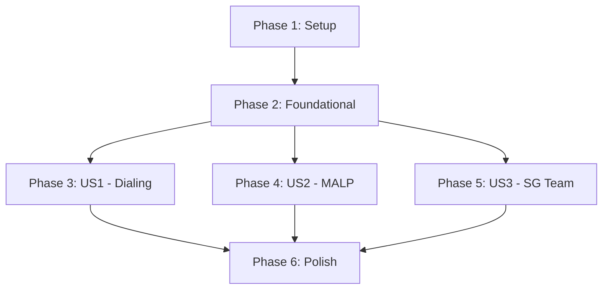

# Tasks: SGC Command Interface

**Input**: Design documents from `/specs/001-sgc-command-interface/`
**Prerequisites**: plan.md (required), spec.md (required for user stories), research.md, data-model.md, contracts/

**Tests**: Vitest 2.x is used for domain logic testing as specified in plan.md.

**Organization**: Tasks are grouped by user story to enable independent implementation and testing of each story.

## Format: `[ID] [P?] [Story] Description`

- **[P]**: Can run in parallel (different files, no dependencies)
- **[Story]**: Which user story this task belongs to (e.g., US1, US2, US3)
- Include exact file paths in descriptions

## Phase 1: Setup (Shared Infrastructure)

**Purpose**: Project initialization and basic structure

- [x] T001 Initialize Vite 6 project with basic dependencies in `./`
- [x] T002 Create project directory structure (domain, infrastructure, ui, data, styles, tests) per `plan.md`
- [x] T003 [P] Configure Vitest and ESLint in `package.json` and config files

---

## Phase 2: Foundational (Blocking Prerequisites)

**Purpose**: Core infrastructure and data that MUST be complete before ANY user story can be implemented

**⚠️ CRITICAL**: No user story work can begin until this phase is complete

- [x] T004 Define `IStorageRepository.js` interface and implement `LocalStorageRepository.js` in `src/infrastructure/`
- [x] T005 Create core entities `Planet.js` and `GameState.js` in `src/domain/entities/`
- [x] T006 Populate static data files: `planets.json` and `gate-symbols.json` in `src/data/`
- [x] T007 Setup design system: `main.css` (variables) and `sgc-theme.css` (CRT style) in `src/styles/`
- [x] T008 [P] Implement base `main.js` and `index.html` shell

**Checkpoint**: Foundation ready - user story implementation can now begin in parallel

---

## Phase 3: User Story 1 - Sélection et saisie de coordonnées (Priority: P1) 🎯 MVP

**Goal**: Enable operators to select a destination from a list or dial manually.

**Independent Test**: Select a planet from the filtered list OR dial a valid 7-chevron address and verify the gate "activates" and state updates.

### Tests for User Story 1
- [x] T009 [P] [US1] Create unit tests for `GateService` in `tests/domain/GateService.test.js`

### Implementation for User Story 1
- [x] T010 [US1] Implement `GateService.js` logic for address validation and state updates in `src/domain/services/`
- [x] T011 [P] [US1] Create `PlanetListPanel.js` UI component in `src/ui/components/`
- [x] T012 [P] [US1] Create `ManualDialingPanel.js` UI component in `src/ui/components/`
- [x] T013 [US1] Create `GateAnimation.js` (rotation/vortex) in `src/ui/animations/` and `animations.css`
- [x] T014 [US1] Integrate US1 components into `main.js` and `index.html`

**Checkpoint**: User Story 1 is fully functional. Operators can lock destinations.

---

## Phase 4: User Story 2 - Envoi d'un MALP (Priority: P1)

**Goal**: Scout a planet to reveal biome information and anime-style visuals.

**Independent Test**: Clicking "Envoyer MALP" on a locked destination plays the animation and reveals biome data + image.

### Tests for User Story 2
- [x] T015 [P] [US2] Create unit tests for `MALPService` in `tests/domain/MALPService.test.js`

### Implementation for User Story 2
- [x] T016 [US2] Implement `MALPService.js` in `src/domain/services/`
- [x] T017 [P] [US2] Create `PlanetInfoPanel.js` to display biome details in `src/ui/components/`
- [x] T018 [P] [US2] Create `ActionPanel.js` with MALP trigger in `src/ui/components/`
- [x] T019 [US2] Create `MALPAnimation.js` in `src/ui/animations/`
- [x] T020 [US2] Add anime-style biome assets in `src/ui/assets/biomes/`

**Checkpoint**: User Story 2 is functional. Scouting reveals world details.

---

## Phase 5: User Story 3 - Envoi d'une équipe SG et historique (Priority: P2)

**Goal**: Execute missions, generate narrative reports, and track exploration history.

**Independent Test**: Sending an SG team creates a mission report in the history; verify death/survival logic based on danger.

### Tests for User Story 3
- [x] T021 [P] [US3] Create unit tests for `SGTeamService` and `NarrativeEngine` in `tests/domain/`

### Implementation for User Story 3
- [x] T022 [P] [US3] Create `Mission.js` and `MissionReport.js` entities in `src/domain/entities/`
- [x] T023 [US3] Implement `NarrativeEngine.js` with `narrative-templates.json` in `src/domain/services/` and `src/data/`
- [x] T024 [US3] Implement `SGTeamService.js` (danger logic, history persistence) in `src/domain/services/`
- [x] T025 [P] [US3] Create `MissionReportModal.js` and `ConfirmModal.js` (danger warning) in `src/ui/components/`
- [x] T026 [US3] Create `SGTeamAnimation.js` in `src/ui/animations/`
- [x] T027 [US3] Add SG moment assets in `src/ui/assets/moments/`

**Checkpoint**: All user stories functional. Full mission lifecycle implemented.

---

## Phase 6: Polish & Cross-Cutting Concerns

**Purpose**: Final refinements and verification.

- [x] T028 Performance optimization: Ensure animations run at 60fps
- [x] T029 UX Polish: Add scanline filters and terminal sound effects (if requested)
- [x] T030 Final validation against `quickstart.md` scenarios

---

## Dependencies & Execution Order

1. **Setup (Phase 1)** → **Foundational (Phase 2)** (Blocks all stories)
2. **US1 (Phase 3)**: Primary entry point.
3. **US2 (Phase 4)**: Depends on `PlanetInfoPanel` shell but independent of US3.
4. **US3 (Phase 5)**: Depends on US2 for scouting warnings (T025 checks scouting status).

---

## Implementation Strategy

### MVP First
Complete Phase 1, 2, and 3 first to have a working dialing interface. Then add MALP (US2) for data visualization.

### Parallel Opportunities
- UI Component creation (T011, T012, T017, T018, T025) can happen in parallel.
- Unit Testing (T009, T015, T021) can happen before or during implementation.
