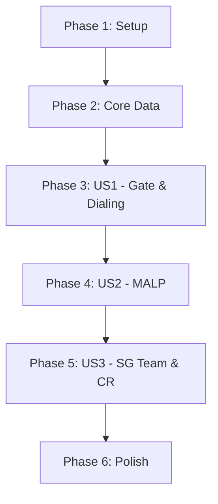

# Tasks: SGC Command Interface

**Feature**: 001-sgc-command-interface | **Plan**: [plan.md](./plan.md)

---

## Implementation Strategy

L'implémentation suit une approche **MVP First** et **Spec-Driven**. Nous construisons d'abord le socle technique (Vite, Architecture domaine/infra), puis nous livrons chaque User Story de manière indépendante et testable.

> [!IMPORTANT]
> Conformément à la Constitution IV, la logique métier dans `src/domain` doit rester pure (sans DOM/window/localStorage) pour être testable via Vitest.

---

## Phase 1: Setup

- [ ] T001 Initialiser le projet web avec Vite 6.x (`npm create vite@latest . -- --template vanilla`)
- [ ] T002 Configurer Vitest 2.x pour les tests unitaires du domaine
- [ ] T003 Créer l'arborescence complète des dossiers (`src/domain`, `src/infrastructure`, `src/ui`, `src/data`, `src/styles`)
- [ ] T004 Configurer `vite.config.js` et le `package.json` avec les scripts de build/test

## Phase 2: Foundational (Core Data & Persistence)

- [ ] T005 [P] Créer `src/data/gate-symbols.json` avec les 36 glyphes de la Voie Lactée
- [ ] T006 [P] Compiler l'intégralité du corpus canonique (~200+ planètes) dans `src/data/planets.json` via le skill `stargate-specialist`
- [ ] T007 [P] Créer les interfaces de base dans `src/domain/entities/Planet.js`, `Mission.js` et `GameState.js`
- [ ] T008 [P] Définir l'interface `src/domain/repositories/IStorageRepository.js`
- [ ] T009 [P] Implémenter `src/infrastructure/LocalStorageRepository.js` pour la persistance navigateur

## Phase 3: [US1] Sélection et Composition Manuelle

**Story**: Sélectionner dans la liste ou composer manuellement 7 chevrons pour verrouiller une destination.
**Test**: Composer "Abydos" manuellement → la porte s'ouvre, la planète est ajoutée/sélectionnée. Filtrer la liste → les résultats changent.

- [ ] T010 [Story1] Implémenter `src/domain/services/GateService.js` (validation adresse, filtrage, dialing logic)
- [ ] T011 [P] [Story1] Créer `src/ui/components/PlanetListPanel.js` (liste filtrable)
- [ ] T012 [P] [Story1] Créer `src/ui/components/ManualDialingPanel.js` (clavier de chevrons)
- [ ] T013 [Story1] Implémenter `src/ui/animations/GateAnimation.js` (CSS keyframes : rotation → verrouillage → vortex)
- [ ] T014 [Story1] Intégrer la logique de composition dans `src/main.js` et `index.html` (shell UI SGC)

## Phase 4: [US2] Exploration MALP (Reconnaissance)

**Story**: Envoyer un MALP pour révéler le biome et l'environnement avec une illustration anime.
**Test**: Sélectionner une planète inconnue → Envoyer MALP → Voir l'image du biome et les données environnementales apparaître.

- [ ] T015 [Story2] Implémenter `src/domain/services/MALPService.js` (mise à jour profil planète après envoi)
- [ ] T016 [P] [Story2] Créer `src/ui/components/PlanetInfoPanel.js` (affichage biome, informations découvertes)
- [ ] T017 [P] [Story2] Étendre `src/ui/components/ActionPanel.js` avec l'option "Envoyer MALP"
- [ ] T018 [Story2] Implémenter `src/ui/animations/MALPAnimation.js` (transition scanlines/transmission)
- [ ] T019 [Story2] Générer les assets de biomes canoniques dans `src/ui/assets/biomes/` (style anime)

## Phase 5: [US3] Équipe SG, Mission & Comptes Rendus (CR)

**Story**: Envoyer une équipe SG, auto-résoudre la mission et générer un rapport narratif historisé.
**Test**: Envoyer SG-1 sur une planète dangereuse sans MALP → confirmer l'alerte → voir le CR annonçant les pertes avec illustration du moment fort.

- [ ] T020 [Story3] Implémenter `src/domain/services/NarrativeEngine.js` avec le système de templates multi-sections
- [ ] T021 [Story3] Implémenter `src/domain/services/SGTeamService.js` (résolution mission, calcul danger, génération rapports)
- [ ] T022 [P] [Story3] Créer `src/ui/components/MissionReportModal.js` (UI du CR style terminal militaire)
- [ ] T023 [P] [Story3] Créer `src/ui/components/ConfirmModal.js` (alerte envoi sans MALP)
- [ ] T024 [Story3] Implémenter `src/ui/animations/SGTeamAnimation.js` (silhouettes traversant le vortex)
- [ ] T025 [Story3] Compiler les templates narratifs spécifiques dans `src/data/planet-narratives.json`

## Phase 6: Polish, Persistence & Assets

- [ ] T026 [P] Appliquer le thème CSS final (`src/styles/sgc-theme.css`) : effets CRT, scanlines, lueurs holographiques
- [ ] T027 [P] Générer le pool d'illustrations moments forts dans `src/ui/assets/moments/` (style anime)
- [ ] T028 Finaliser l'orchestration de l'auto-save dans `src/main.js` (sauvegarde à chaque action majeure)
- [ ] T029 Optimiser les performances des animations et le poids des assets (WebP conversion)

---

## Dependencies

## Parallel Execution

- T005, T006, T007, T008 peuvent être réalisés en parallèle après T003.
- Les composants UI ([P]) de chaque story peuvent souvent être développés en même temps que les services de domaine associés.
